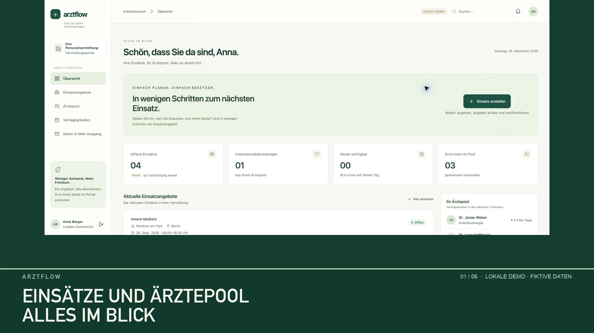
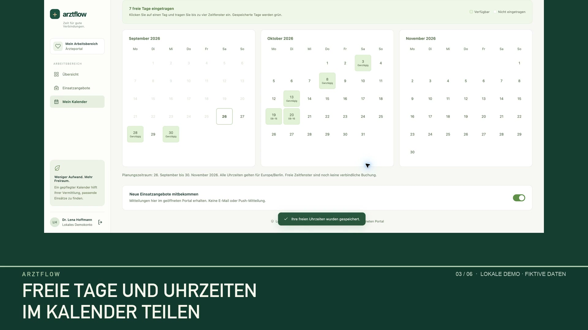
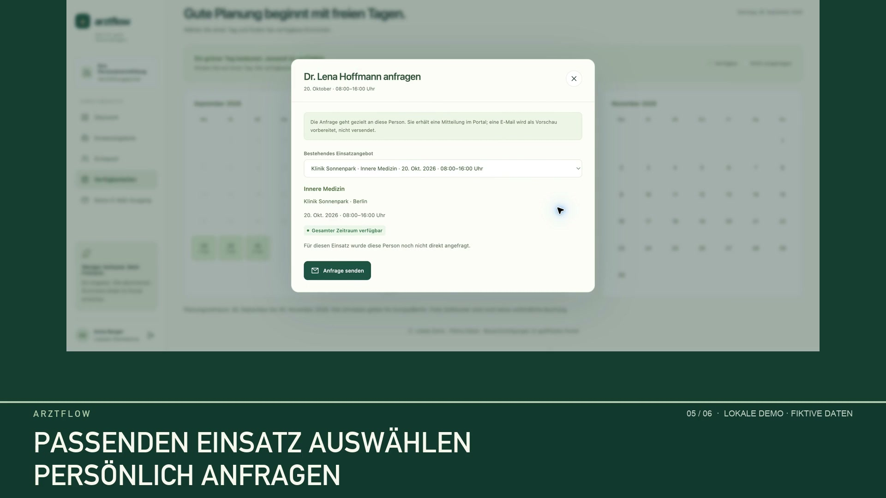

# ArztFlow

### Ärztliche Dienste einfacher koordinieren

**Ein Portfolio-Projekt von [Imamali Seyidov](https://github.com/qirmehle).**

ArztFlow ist eine deutschsprachige Web-App für Personalvermittlungen und Ärztinnen und Ärzte. Vermittlungen erfassen Dienste, sehen verfügbare Personen und senden gezielte Anfragen. Ärztinnen und Ärzte pflegen ihre freien Zeitfenster und antworten direkt im Portal.

**Projektstand: funktionsfähiger lokaler MVP mit fiktiven Demodaten. Ein produktiver Betrieb mit echten Nutzern ist noch nicht freigegeben.**

**[Deutsche Produktdemo auf LinkedIn ansehen – 66 Sekunden](https://www.linkedin.com/feed/update/urn:li:activity:7510100230286000129/)**

Alternativ: [Demovideo als MP4 herunterladen (3,4 MB)](https://github.com/qirmehle/arztflow-portfolio/raw/refs/heads/main/assets/arztflow-demo-de.mp4).

Das Video zeigt eine echte Bedienung des lokalen Prototyps: Dienst erfassen → Verfügbarkeit prüfen → persönliche Anfrage senden → Interesse zurückmelden. Alle dargestellten Personen und Einrichtungen sind fiktiv. Die deutsche Sprecherstimme wurde mit KI erzeugt.

## Die Idee

Die Abstimmung zwischen Vermittlung und Ärzten braucht einen gemeinsamen Überblick über Dienste, freie Zeiten und Rückmeldungen. ArztFlow bündelt diese Schritte in einer Oberfläche. Ein grüner Kalendertag zeigt verfügbare Zeitfenster; vor einer persönlichen Anfrage prüft die Anwendung, ob die Verfügbarkeit den gesamten Dienst abdeckt.

## Was bereits funktioniert

| Bereich | Umsetzung im lokalen MVP |
| --- | --- |
| Dienstangebote | Klinik, Fachgebiet, Beginn, Ende und Stundenhonorar erfassen, auch für Dienste über Mitternacht; Texteingaben in einen überprüfbaren Formularentwurf übernehmen |
| Verfügbarkeit | Drei Kalendermonate und mehrere Zeitfenster pro Tag; Nachtverfügbarkeit wird auf die betroffenen Kalendertage verteilt |
| Persönliche Anfragen | Passende Personen gezielt anfragen; Interesse oder Ablehnung im Portal zurückmelden |
| Benachrichtigungen | Mitteilungen im Portal speichern und bei geöffneter Anwendung aktualisieren |
| Firmenportale | Eigener Portalpfad, Name, Logo und Farben; serverseitig getrennte Firmendaten |
| Verwaltung | Firmen und Einladungen verwalten; Testzeiträume und manuell bestätigte Abonnements nachhalten |

Das Video entstand am 26. September 2026 und zeigt den Kernablauf. Firmenportale und Abonnementverwaltung wurden am 27. September ergänzt und sind im Video noch nicht zu sehen. Rechnungsstellung und Zahlung erfolgen außerhalb der Anwendung.

## Einblicke

### Überblick für Vermittlungen

### Freie Tage und Uhrzeiten

### Persönliche Anfrage

## Technischer Ansatz

- **TypeScript und Node.js:** modularer Server mit klar getrennten Zuständigkeiten.
- **SQLite:** persistente Daten, versionierte Migrationen und Transaktionen für zusammengehörende Änderungen.
- **HTML, CSS und Browser-Module:** responsive Oberfläche ohne Frontend-Framework.
- **Serverseitige Prüfungen:** Rollen, Firmenzugehörigkeit und vollständige zeitliche Verfügbarkeit.
- **Lokale Texteingabehilfe:** regelbasierte Auswertung im Browser; kein externer KI-Dienst innerhalb der Anwendung.
- **Keine npm-Laufzeitabhängigkeiten:** Entwicklungswerkzeuge werden getrennt und kontrolliert verwendet.

Konzeption und Umsetzung erfolgten mit KI-gestützten Entwicklungswerkzeugen und ergänzenden Code-Reviews. Produktumfang, nachvollziehbare Abläufe und überprüfte Ergebnisse stehen im Mittelpunkt dieser Fallstudie.

## Qualität und aktueller Stand

Der Entwicklungsstand vom **27. September 2026** wurde mit automatisierten Tests für zentrale Abläufe, Rollen und Firmenzugriffe geprüft. Ausgewählte Nutzerabläufe wurden zusätzlich im Browser und in einer mobilen Ansicht getestet. Testcode und interne Prüfprotokolle bleiben im privaten Entwicklungsrepository.

Diese Angaben beschreiben die private Implementierung. Dieses Portfolio-Repository enthält keine ausführbare Anwendung und stellt keine Produktions- oder Sicherheitszertifizierung dar.

Vor einem echten Pilotbetrieb sind weitere technische und organisatorische Prüfungen sowie ein passendes Betriebs- und Datenschutzkonzept vorgesehen. E-Mails erscheinen in der Demo ausschließlich als Vorschau. Die Rückmeldung erfasst das Interesse an einem Dienst; Vertragsabschluss und Abrechnung sind nicht Bestandteil des gezeigten Ablaufs.

## Über dieses Repository

Diese Präsentation enthält ausschließlich eine Projektbeschreibung, ausgewählte Demobilder und das deutsche Demovideo. Der Anwendungscode, Zugangsdaten, Konfigurationsdateien, Datenbanken und die interne Entwicklungshistorie sind nicht Bestandteil der Veröffentlichung.

Projektprofil: [github.com/qirmehle](https://github.com/qirmehle)
